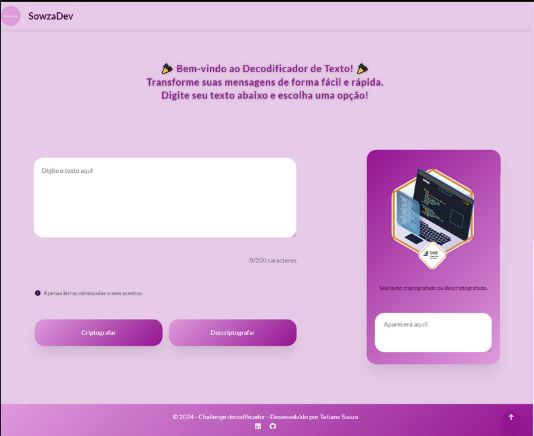

# Challenge Decodificador de Texto

## Descrição

Este projeto é uma versão aprimorada do Decodificador de Texto, desenvolvido originalmente para a primeira fase do programa ONE (Oracle + Alura). Nesta versão, foram implementadas melhorias na interface, na usabilidade e novas funcionalidades. A aplicação permite criptografar e descriptografar mensagens usando um conjunto específico de regras, além de copiar o texto resultante para a área de transferência. A interface foi cuidadosamente projetada para ser responsiva, proporcionando uma experiência fluida tanto em dispositivos móveis quanto em desktops.

## Funcionalidades

- **Criptografar Texto**: Converte caracteres específicos em strings predefinidas, protegendo a mensagem.
- **Descriptografar Texto**: Reverte a criptografia, restaurando o texto ao seu estado original.
- **Copiar Texto**: Permite copiar o resultado para a área de transferência com um único clique.
- **Interface Responsiva**: Garantia de uma experiência consistente em diferentes tamanhos de tela.
- **Alertas**: Feedbacks visuais e sonoros para ações importantes, como cópia de texto e sucesso na criptografia/descriptografia.
- **Contador de Caracteres**: Monitora o número de caracteres digitados pelo usuário.
- **Feedback Temporário**: Mensagem temporária de sucesso ao realizar ações como copiar ou criptografar o texto.

## Tecnologias Utilizadas

- **HTML5**: Estrutura semântica e acessível.
- **CSS3**: Estilização e design responsivo.
- **JavaScript**: Lógica de criptografia/descriptografia e manipulação de DOM.

## Resultado visual e minha badge

  
  

## Como Usar

1. Insira o texto na área designada.
2. Clique em "Criptografar" para proteger o texto ou em "Descriptografar" para revertê-lo.
3. O resultado aparecerá na área designada para a resposta.
4. Clique em "Copiar" para copiar o texto criptografado ou descriptografado.
5. Se desejar, cole o texto copiado de volta na área de texto principal para novas operações.

## Regras de Criptografia

- **e** é convertido em `enter`
- **i** é convertido em `imes`
- **a** é convertido em `ai`
- **o** é convertido em `ober`
- **u** é convertido em `ufat`

## Regras de Descriptografia

- `enter` é convertido em **e**
- `imes` é convertido em **i**
- `ai` é convertido em **a**
- `ober` é convertido em **o**
- `ufat` é convertido em **u**

## Autor

- **Tatiane Souza** - [LinkedIn](https://www.linkedin.com/in/sowza82-tatiane-souza/)

## Licença

Este projeto foi desenvolvido como parte de uma atividade educacional no curso "Iniciante em Programação T7" da ONE (Oracle + Alura) e não está aberto para colaborações externas.
